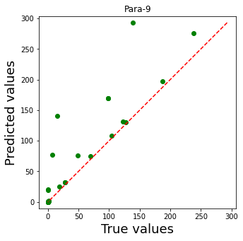
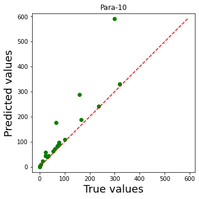
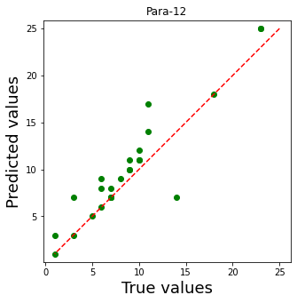
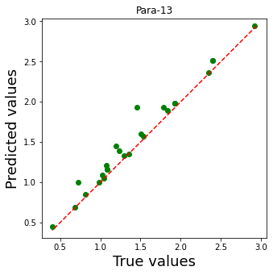

# Road-Time-Series-Assgn-1
Predicting the required parameters 9 to 13 for all sections for the 10th year. I have used DecisionTreeRegressor available in the sklearn library to get those predicitions.

I have used pandas and numpy libraries to perform Data preprocessing required.

# RMSE for parameters: 

**Parameter 9**

**Parameter 10**

**Parameter 11**

**Parameter 12**

**Parameter 13**

